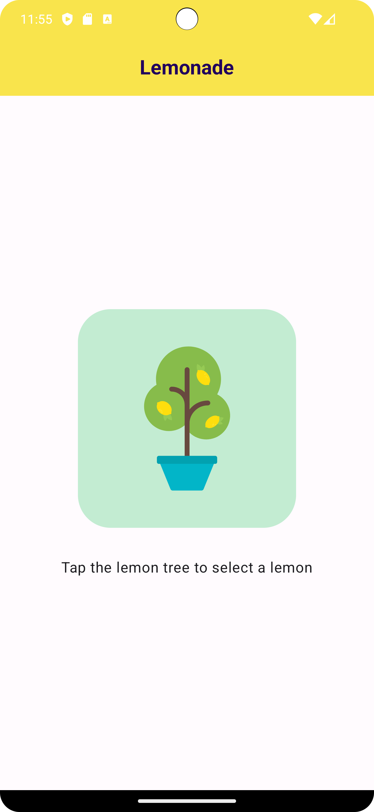

# Lemonade App

A simple Lemonade app that lets you juice lemons when you tap the image on screen until you have a digital glass of lemonade. It's developed using Jetpack Compose components like ```Column```, ```Button```, ```Text```, ```Image```, and ```Modifier```.


<p align="center">
  
</p>